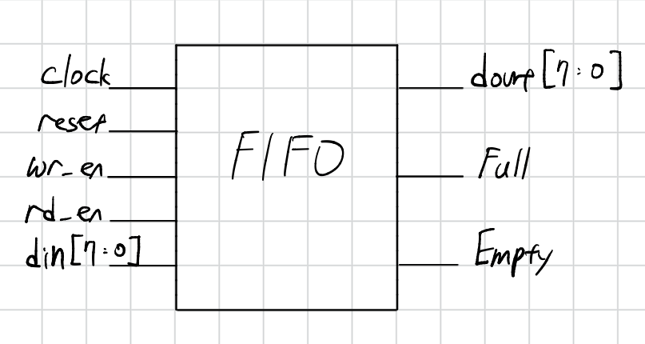
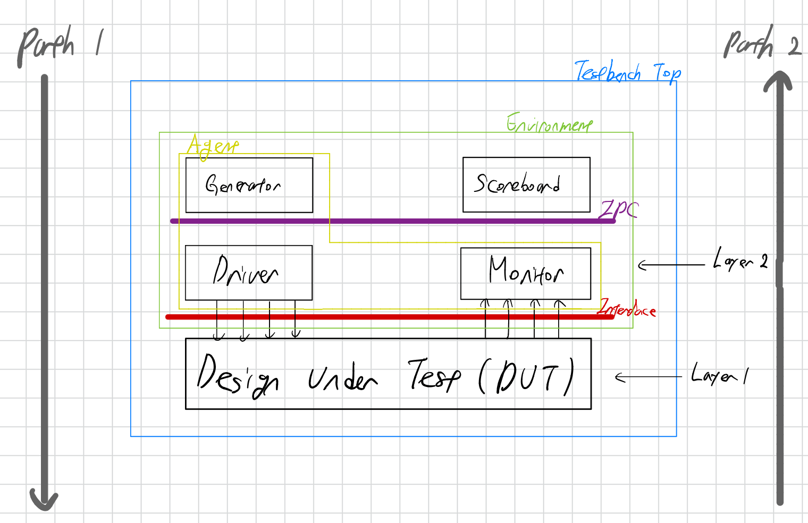
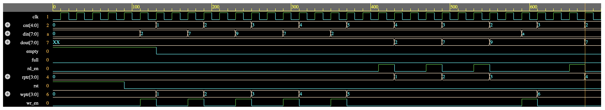

## FIFO Verification Project

This project is not only verify a FIFO (First-In-First-Out) memory, but also to understand and implement a SystemVerilog-class based testbench environment. 

The environment follows a modular testbench architecture that includes the following components:
- Generator: Generates different input stimulus to be driven to DUT
- Driver: Drives stimulus to the DUT
- Monitor: Observes DUT signals and capture design activity
- Scoreboard: Compares DUT outputs with expected results
- Environment: Contains all the verification components
- Interface: Contains design signals that can be driven or monitored

## DUT

## Testbench Architecture

## Waveform

> Note: The simulation was performed using **EDA Playground**, as no SystemVerilog simulator
