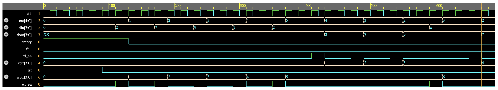

# FIFO Verification 

## Introduction
This project verifies a parameterized synchronous FIFO using a SystemVerilog class-based verification environment. 
A modular testbench architecture was built to validate the FIFO functionality through constrained-random stimulus, SystemVerilog Assertions (SVA), and coverage metrics. 

## Verification Methodology
The modular testbench architecture includes the following components:
- **Generator**: Generates different input stimulus to be driven to DUT
- **Driver**: Drives stimulus to the DUT
- **Monitor**: Observes DUT signals and capture design activity
- **Scoreboard**: Compares DUT outputs with expected results
- **Environment**: Contains all the verification components
- **Interface**: Contains design signals that can be driven or monitored

### Testbench Architecture

### SystemVerilog Assertions (SVA)
Assertions were implemented to automatically verify specific conditions or protocol of FIFO during simulation.

### Coverage
Coverage metrics were used to measure how much the design has been tested and evaluate the verification completeness. 

## Waveform

> Note: The simulation was performed using **EDA Playground**, as no SystemVerilog simulator.
