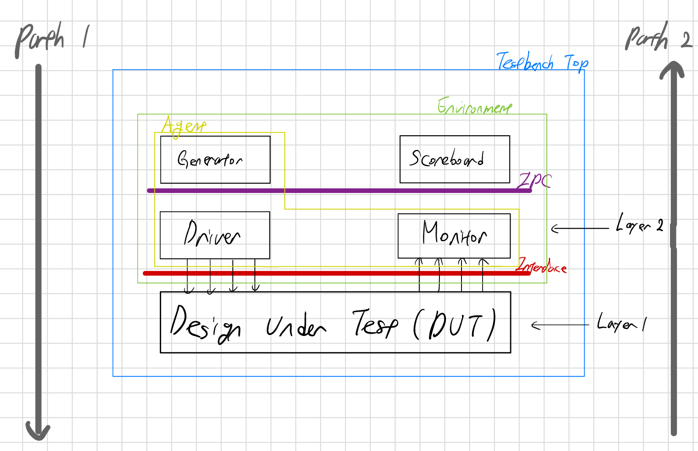
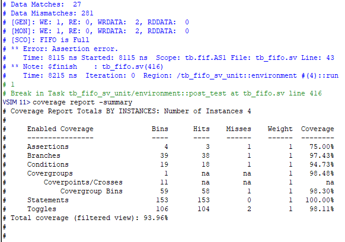

# FIFO Verification 

## Contents
- [Introduction](#introduction)
- [Verification Methodology](#verification-methodology)
- [Verification Results](#verification-results)
- [Repository Structure](#repository-structure)
- [Report](#report)

## Introduction
This project verifies a parameterized synchronous FIFO using a SystemVerilog class-based verification environment. 
A modular testbench architecture was built to validate the FIFO functionality through constrained-random stimulus, SystemVerilog Assertions (SVA), and coverage metrics. 

## Verification Methodology
The modular testbench architecture consists of following components:
- **Generator:** Generates different input stimulus to be driven to DUT
- **Driver:** Drives stimuli to the DUT
- **Monitor:** Observes DUT signals and captures design activity
- **Scoreboard:** Compares DUT outputs with expected results
- **Environment:** Contains all the verification components
- **Interface:** Contains design signals that can be driven or monitored

### Testbench Architecture


### SystemVerilog Assertions (SVA)
Assertions were implemented to automatically verify specific conditions or protocol of FIFO during simulation.

### Coverage
Coverage metrics were used to measure how much the design has been tested and evaluate the verification completeness. 

## Verification Results
### Coverage Summary
| Metric | Value (%) |
|--------|----------:|
| Functional | 98.48 |
| Statement | 100.00 |
| Branch | 97.43 |
| Condition | 94.73 |
| Toggle | 98.11 |
| Total | 93.96 |



### Assertion Results
Three assertions (SVA) were applied to verify FIFO functional behaviour and protocol violations. 

Among the three assertions, AS2 and AS3 were satisfied without any violations during simulation. However, AS1 reported 92 failures.

## Repository Structure
```
FIFO_Verification/
│
├── rtl/
│ └── fifo.sv                      # DUT
│
├── tb/
│ └── tb_fifo.sv                   # SystemVerilog testbench (includes all verification components)
│
├── docs/
│ ├── Testbench_Architecture.png   # Testbench architecture diagram
│ ├── coverage_summary.png         # Coverage report summary
│ └── coverage_report.txt          # Detailed assertion and coverage results
│
├── report/
  └── FIFO_Verification_report.pdf # Detailed verification report
```

## Report
Detailed assertion results and coverage analysis are available in 
[coverage_report.txt](docs/coverage_report.txt).

The complete verification methodology, assertion analysis, coverage results, and design issue identification are documented in the [download FIFO verification report (PDF)](https://github.com/JinELEC/FIFO_Verification/raw/main/report/FIFO_Verification_report.pdf).
